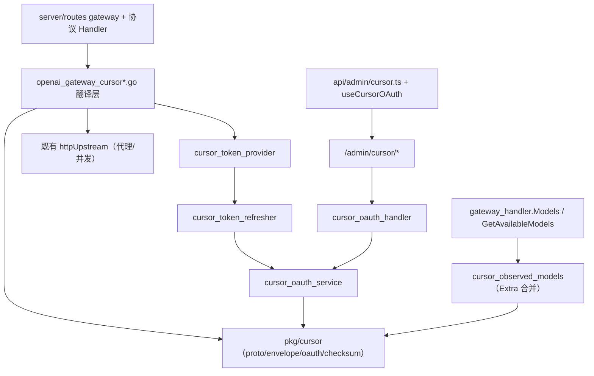

## Context

### 当前系统

sub2api 已经支持 Anthropic / OpenAI / Gemini / Antigravity / Grok 五个上游平台，全部复用同一套基础设施：

- 平台枚举以 `backend/internal/domain/constants.go` 为事实源，`backend/internal/service/domain_constants.go` re-export，并维护 `AllowedQuotaPlatforms` / `AllowedSchedulingThresholdPlatforms` 白名单。
- 账号存储、分组、调度、计费、粘性会话、限流封禁、令牌刷新（`TokenRefreshService.registrations`）、令牌缓存失效（`token_cache_invalidator.go`）、调度快照（`scheduler_snapshot_service.go`）都以 `account.Platform` 为分派键。
- 对外 `/v1/models` 由 `handler/gateway_handler.go: Models` → `service.GatewayService.GetAvailableModels` 汇聚；`GetAvailableModels` 只从各账号的 `model_mapping` 收集，`writeModelsList` 对 Grok 走 `writeGrokModelsList` 使用 `xai.DefaultModels()` 兜底。
- SQL migration 是 schema 事实源，`platform IN (...)` / `target_platform IN (...)` 的 CHECK 约束分散在多个迁移里（如 142 → 157 加 grok、172 composite）。

Grok 是最近一次完整接入的平台，提供了清晰的“平台适配”文件模板：

```text
domain 常量
→ pkg/xai/（上游协议与 OAuth）
→ service/grok_oauth_service.go / grok_token_provider.go / grok_token_refresher.go / grok_credential_failure.go
→ service/grok_observed_models.go（动态模型统计，写入 account.Extra）
→ service/grok_upstream_{url,headers,errors}.go
→ service/openai_gateway_grok*.go（网关翻译 / SSE 处理）
→ repository/grok_oauth_client.go
→ handler/admin/grok_oauth_handler.go + server/routes/admin.go 注册
→ 前端表单 / composable / i18n
→ migrations 里的 platform CHECK 约束（157 / 172 / 176）
```

### Cursor 与既有平台的关键差异

Grok 是 OpenAI 兼容 JSON 上游，可以直接挂在既有 OpenAI 网关透传。Cursor **不是**：

- Cursor 走 **Connect RPC over HTTP/2 + Protobuf**，且**分两个互不相同的上游**：
  - **模型列表（api2）**：`POST https://api2.cursor.sh/aiserver.v1.AiService/AvailableModels`，unary，`application/proto`，不封帧。真机验证仍可用。
  - **对话（api5）**：`POST https://agentn.global.api5.cursor.sh/agent.v1.AgentService/Run`，`application/connect+proto`，**HTTP/2 双向流**。api2 的 `ChatService/StreamUnifiedChatWithTools` 已被 Cursor 下线（任何客户端版本都回 "Update Required"），首期实现一度走该端点，现已切换。
  - 帧格式两者共用：每帧 5 字节 envelope 前缀（1 字节 flag + 4 字节大端消息长度），后接 protobuf 消息体；流式响应由多帧串联，末帧为带 EndStream flag 的 trailer 帧。
- 两个上游的**请求头集合完全不同**，混用即被拒：
  - **api2**（`AvailableModels`）需要动态生成的 Cursor 客户端标识：`x-cursor-checksum`（`machineId = sha256(token + "machineId")` 等派生拼合 + Jyh 风格滚动异或时间戳混淆）、`x-client-key = sha256(token)`、`x-session-id = uuidv5(DNS, token)`，以及若干 `x-cursor-*` 头（client version、timezone、config version 等）。
  - **api5**（`AgentService/Run`）**只发 10 个头**，且**不发**任何 identity/checksum 头：`authorization`、`content-type`、`connect-protocol-version`、`connect-accept-encoding`、`x-cursor-client-version`（`cli-<YYYY.MM.DD>-<sha>` 形态，版本过旧回 `permission_denied`）、`x-cursor-client-type: cli`、`x-ghost-mode`、`x-request-id`、`x-original-request-id`、`user-agent`。多发 api2 那一套是可观测的行为变化，不是无害超集。
  - 两条链路共用同一份**订阅 session 客户端令牌**（web cookie 需先经深链兑换升级）；api5 不需要官方 `crsr_` API Key。

因此 Cursor 必须新建独立上游协议包 `backend/internal/pkg/cursor/`，并在网关层做“OpenAI Chat Completions ⇄ Cursor protobuf”双向翻译，而不是复用现有 JSON 透传。

> 仓库现有 `cursor` 字样（`openai_gateway_chat_completions.go` 的 `isResponsesShape`、`cursorResponsesUnsupportedFields`）是把 Cursor IDE 当【客户端】做入站兼容，方向与本变更相反，不能作为实现基础。

### 目标项目约束

- 后端 Go + Gin + Wire；前端 Vue 3 + TypeScript + pnpm。
- PostgreSQL SQL migration 是 schema 事实源，Ent 自动迁移不是生产建表入口。
- 平台枚举必须在所有触点同步，否则会出现调度 / 计费 / 校验漂移。
- 新平台默认对既有请求零影响；未配置 Cursor 账号时行为不变。
- 凭据（Cursor access token / API Key / refresh token）必须复用现有加密 credentials 存储，不得进入日志、错误响应或前端持久化状态。

## Goals / Non-Goals

**Goals:**

- 新增 `PlatformCursor = "cursor"` 并在所有平台枚举触点同步，达到与 Grok 同级的接线完整度。
- 用独立 `pkg/cursor` 承载 Connect/protobuf 上游协议，将 wire 复杂度隔离在协议包内，网关层只依赖稳定的 Go 接口。
- 在网关层实现 OpenAI Chat Completions ⇄ Cursor protobuf 双向翻译，支持非流式与 SSE 流式。
- 支持三种凭据来源和两条 JWT 刷新路径，接入既有令牌刷新与缓存失效框架。
- 实现动态模型统计，并把 observed 模型合并进对外 `/v1/models` 与 Admin 可用模型接口（补齐 Grok 现状缺口）。
- 复用既有账号 / 分组 / 调度 / 计费 / 粘性会话 / 限流封禁。

**Non-Goals:**

- 不改动既有把 Cursor IDE 当客户端的入站兼容逻辑。
- 不实现 Cursor 的图像 / 视频 / 音频等非文本能力。
- 不引入超出仓库既有依赖的重型 protobuf/HTTP2 运行时。
- 不硬编码 Cursor 默认模型清单作为对外事实源。

## Decisions

### 1. 平台枚举以 Grok 为模板逐点同步（Phase B）

新增 `PlatformCursor = "cursor"` 后，必须同步以下触点。下表是提案编写时确认的现状引用点，实施时以代码为准并用编译 + grep 复核：

| 触点文件 | 现状（Grok 引用） | Cursor 需要的动作 |
| --- | --- | --- |
| `internal/domain/constants.go` | `PlatformGrok = "grok"`（const 块 19–27） | 增加 `PlatformCursor = "cursor"` |
| `internal/service/domain_constants.go` | re-export（41–46）+ `AllowedQuotaPlatforms`（55–61）+ `AllowedSchedulingThresholdPlatforms`（65–69） | re-export；`cursor` 加入 `AllowedQuotaPlatforms`；**不**加入 `AllowedSchedulingThresholdPlatforms`（Cursor 缺乏干净的原生用量窗口，见决策 8） |
| `internal/model/error_passthrough_rule.go` | const（37–39）+ `AllPlatforms()`（44） | 增加常量并加入 `AllPlatforms()` |
| `internal/service/composite_platform.go` | `isConcreteRequestPlatform`（182）等 | 视 Cursor 是否可作为 composite 目标决定是否加入；默认加入 concrete 集合 |
| `internal/service/group.go` | `profitControlPlatformSupported`（449–454） | 按是否支持利润控制决定；默认可加入（复用计费） |
| `internal/service/admin_group.go` | 平台校验 | 允许 Cursor 分组 |
| `internal/service/channel_service.go` | 平台分派 | 允许 Cursor 渠道（如适用） |
| `internal/service/scheduler_snapshot_service.go` | switch（612）+ `schedulerSnapshotPlatforms() [5]string`（827–829） | 加入 switch 分支；数组长度 `[5]` → `[6]` |
| `internal/service/token_refresh_service.go` | `registrations`（134–142） | 注册 `{platform: PlatformCursor, refresher: cursorRefresher, executor: cursorRefresher}` |
| `internal/service/token_cache_invalidator.go` | switch（47–49） | 增加 `case PlatformCursor` 删除对应 token cache key |
| `internal/service/wire.go` + `cmd/server/wire_gen.go` | Grok provider（20、127…） | 增加 Cursor provider 与 Bind |
| `internal/server/routes/admin.go` | `registerGrokOAuthRoutes`（58、466） | 增加 `registerCursorOAuthRoutes` |
| `internal/server/routes/gateway.go` | 平台路由 | 若 Cursor 需要独立 gateway 分派则接线 |
| `internal/handler/openai_gateway_handler.go` | Grok 分派 | Cursor 走 protobuf 翻译分派 |
| `internal/handler/gateway_handler.go` | `Models`（1073）、`compositeAvailableModels`（1150 平台数组）、`writeModelsList`（1172） | 平台数组加入 Cursor；合并 observed 模型（见决策 7） |
| `internal/handler/endpoint.go` | `PlatformOpenAI, PlatformGrok`（187） | 视 Cursor endpoint 归一策略接线 |
| `migrations/NNN_*.sql` | 157 / 172 CHECK 约束 | 新增迁移把 `cursor` 加入所有 `platform IN (...)` |

**备选方案：用配置驱动的平台注册表替代逐点枚举。** 放弃——超出本变更范围，会牵动全部既有平台的重构风险；遵循 Grok 既定模式更安全、可评审。

### 2. 上游协议独立成 `backend/internal/pkg/cursor/`（Phase C）

与 `pkg/xai` 对 Grok 的作用一致，`pkg/cursor` 隔离所有 Cursor wire 细节，对上层只暴露 Go 结构与函数。建议文件：

```text
backend/internal/pkg/cursor/
├── doc.go                 # 端点常量、主域 api2.cursor.sh、协议说明
├── models.go              # AvailableModels 请求/响应的 Go 表示与解析（api2，仍在用）
├── chat.go                # StreamUnifiedChatWithTools 请求/响应的 Go 表示（api2，已下线，保留备回滚）
├── agent_const.go         # api5 主域/端点、CLI 版本钉住、BuildAgentHeaders（10 个头）
├── agent_request.go       # AgentRunParams 与 BuildRunFrameSequence（限速分帧计划）
├── agent_response.go      # AgentEvent 解码、Connect code → HTTP status
├── agent_stream.go        # OpenAgentStream：h2 双向流驱动 + 心跳 + 首字节/空闲超时
├── proto.go               # protobuf 消息定义（字段号见下，已冻结）与 marshal/unmarshal
├── envelope.go            # Connect 帧编解码：[flag:1][len:4 大端][payload] 读写
├── oauth.go               # 凭据形态、exchange_user_api_key、/oauth/token refresh、深链 /auth/poll
├── checksum.go            # x-cursor-checksum / machineId / Jyh 时间戳混淆（算法已冻结）
├── identity.go            # x-client-key=sha256hex(token)、x-session-id=uuid5(DNS,token)、x-cursor-* 头
└── *_test.go
```

对外接口（字段号已由上游协议研究冻结，签名以实现为准）：

```go
package cursor

const (
    DefaultBaseURL = "https://api2.cursor.sh"

    EndpointAvailableModels = "/aiserver.v1.AiService/AvailableModels"
    EndpointStreamChat      = "/aiserver.v1.ChatService/StreamUnifiedChatWithTools" // 已被上游下线

    ContentTypeConnectProto = "application/connect+proto"

    // 对话上游（api5）。DefaultAgentBaseURL 是当前 cursor-agent CLI 的目标，
    // 另有 AgentBaseURLDirect / AgentBaseURLRegionUS 两个区域备选。
    DefaultAgentBaseURL = "https://agentn.global.api5.cursor.sh"
    EndpointAgentRun    = "/agent.v1.AgentService/Run"
)

// DefaultCLIClientVersion 是 x-cursor-client-version 的钉住值，随上游版本下限上调而维护。
var DefaultCLIClientVersion = "cli-2026.08.11-e8db854"

// ---- Connect 帧编解码 ----

// EnvelopeFlag 标识帧类型：
//   0x00 数据帧、0x01 gzip 数据帧、
//   0x02 流结束/trailer 帧（payload 为 JSON：{}=正常，含 error 字段=错误）、
//   0x03 gzip 结束帧。
type EnvelopeFlag byte

const (
    FlagData      EnvelopeFlag = 0x00
    FlagDataGzip  EnvelopeFlag = 0x01
    FlagEndStream EnvelopeFlag = 0x02
    FlagEndGzip   EnvelopeFlag = 0x03
)

// WriteEnvelope 把一段已编码的 protobuf payload 包成一帧写入 w：[flag:1][len:4 大端 uint32][payload]。
func WriteEnvelope(w io.Writer, flag EnvelopeFlag, payload []byte) error

// EnvelopeReader 从 HTTP/2 响应体逐帧读取 Connect envelope。
type EnvelopeReader struct{ /* ... */ }
func NewEnvelopeReader(r io.Reader) *EnvelopeReader
func (er *EnvelopeReader) Next() (flag EnvelopeFlag, payload []byte, err error) // io.EOF 结束

// ---- protobuf 消息（字段号已冻结）----
//
// AvailableModelsRequest { bool use_model_parameters=5; bool do_not_use_markdown=7 }（空 body 亦可）
// AvailableModelsResponse { repeated Model models=2 }
// Model {
//   string name=1; bool supports_images=10; bool supports_max_mode=14;
//   int64 context_token_limit=15; int64 max_mode_context_token_limit=16;
//   string client_display_name=17; string server_model_name=18;
//   bool supports_non_max_mode=19; repeated Variant parameterized_variants=30
// }
// Variant { repeated Param params=1; string display_name=2; bool is_max_mode=3; (=4/5/8/9) }
// Param   { id=1; value=2 }
// 注：无直接 is_premium 字段，是否 premium 结合定价表判断。

type AvailableModelsRequest struct {
    UseModelParameters bool // field 5
    DoNotUseMarkdown   bool // field 7
}
type AvailableModelsResponse struct {
    Models []ModelInfo // field 2
}
type ModelInfo struct {
    Name                     string // field 1
    SupportsImages           bool   // field 10
    SupportsMaxMode          bool   // field 14
    ContextTokenLimit        int64  // field 15
    MaxModeContextTokenLimit int64  // field 16
    ClientDisplayName        string // field 17
    ServerModelName          string // field 18
    SupportsNonMaxMode       bool   // field 19
    // parameterized_variants=30 用于 max-mode/param 变体，模型 ID 汇聚以 name 为准
}

func MarshalAvailableModelsRequest(req *AvailableModelsRequest) ([]byte, error)
func UnmarshalAvailableModelsResponse(payload []byte) (*AvailableModelsResponse, error)

// 对话请求：
// StreamUnifiedChatRequestWithTools { StreamUnifiedChatRequest request=1 }
// StreamUnifiedChatRequest {
//   repeated ConversationMessage messages=1; Instruction instruction=3(system prompt);
//   Model model=5; string conversation_id=23; Metadata metadata=26; bool is_agentic=27;
//   bytes supported_tools=29; repeated MessageId message_ids=30; bool large_context=35;
//   int32 unified_mode=46(1=CHAT,2=AGENT); bool should_disable_tools=48;
//   int32 thinking_level=49(0/1/2); string unified_mode_name=54
// }
// ConversationMessage { content=1; int32 role=2(1=USER,2=ASSISTANT); id=13; repeated ToolResult tool_results=18 }
// Model       { name=1; empty=4 }
// Instruction { text=1 }

type ChatMessage struct {
    Content string
    Role    int32 // 1=USER, 2=ASSISTANT
    ID      string
    // ToolResults 等按需
}
type ChatRequest struct {
    Model         string
    SystemPrompt  string        // → Instruction.text
    Messages      []ChatMessage
    ConversationID string
    UnifiedMode   int32         // 1=CHAT, 2=AGENT（首期 CHAT）
    ThinkingLevel int32         // 0/1/2
    SupportedTools []byte       // tools 原样透传编码（见决策 4）
}

// 对话响应：
// StreamUnifiedChatResponseWithTools { ClientSideToolV2Call tool_call=1; StreamUnifiedChatResponse response=2 }
// StreamUnifiedChatResponse { string text=1(正文增量); Thinking thinking=25 }
// Thinking { string text=1 }
// ClientSideToolV2Call { id=3; name=9; raw_args=10; is_last=11 }

type ChatDelta struct {
    Text          string    // response.text=1 → delta.content
    ReasoningText string    // response.thinking.text=25/1 → delta.reasoning_content
    ToolCall      *ToolCall // tool_call=1 → delta.tool_calls[]
    FinishReason  string
}
type ToolCall struct {
    ID      string // field 3
    Name    string // field 9
    RawArgs string // field 10
    IsLast  bool   // field 11
}

func MarshalChatRequest(req *ChatRequest) ([]byte, error)
func UnmarshalChatFrame(payload []byte) (*ChatDelta, error)

// ---- 认证 ----

// Credential 是解析后的 Cursor 凭据（来自 Cookie / API Key / 深链登录）。
type Credential struct {
    UserID       string // JWT sub 按最后一个 "|" 取尾；或 WorkosCursorSessionToken 的 userId 段
    AccessToken  string // JWT，~1h 过期
    RefreshToken string // 深链路线可回传；API Key 路线的 refreshToken 不能用于 /oauth/token
    UserAPIKey   string // crsr_ 前缀，可反复 exchange
    ExpiresAt    time.Time
    Source       CredentialSource // cookie | api_key | deep_link
}

func ParseWorkosSessionToken(raw string) (userID, jwt string, err error) // "userId::JWT"
func UserIDFromJWT(jwt string) string                                    // sub 按最后一个 "|" 取尾
func ExchangeUserAPIKey(ctx context.Context, httpDo Doer, apiKey string) (*Credential, error)
func RefreshWithRefreshToken(ctx context.Context, httpDo Doer, refreshToken string) (*Credential, error)

// 深链登录：challenge=base64url(sha256(verifier))；打开
// https://cursor.com/loginDeepControl?challenge=&uuid=&mode=login；轮询
// GET https://api2.cursor.sh/auth/poll?uuid=&verifier=（退避 base 1s × ~1.2，约 60 次）
// 返回 {accessToken, refreshToken, authId}。
func NewDeepLinkChallenge() (verifier, challenge, uuid string)
func PollDeepLink(ctx context.Context, httpDo Doer, uuid, verifier string) (*Credential, error)

// ---- 请求头 ----

// BuildUpstreamHeaders 生成一次上游调用所需的全部头（checksum/client-key/session-id/x-cursor-*）。
func BuildUpstreamHeaders(token string, now time.Time) http.Header
```

> **wire 细节已冻结（本次回填）：** 上表 protobuf 字段号、Connect 封帧 flag 语义、checksum 派生算法（见决策 6）、深链 `/auth/poll` 协议均已由上游协议研究确认，`pkg/cursor` 按此实现，去除 `// TODO(wire)` 占位。**仅保留两项二期 TODO**（确属未定）：多模态图片字段号、`ClientSideToolV2` 工具枚举完整对照表。
>
> **对话 host 已核定（真机验证）：** 默认 `https://agentn.global.api5.cursor.sh` + `x-ghost-mode: true` 用订阅 session 令牌跑通了完整对话（thinking + text）。另两个已知备选 `agent.api5.cursor.sh` / `agentn.us.api5.cursor.sh` 作为区域覆盖保留，可按账号或部署级配置切换（见决策 4）。原「ghost 模式下 host 待核对」的注记就此关闭。

**备选方案：直接在 `service` 内内联 protobuf 处理。** 放弃——会把 wire 复杂度渗入业务层，难以单测，且违背 Grok 用 `pkg/xai` 隔离协议的既有模式。

### 3. Connect/protobuf 帧编解码策略

- 封帧规则（已冻结）：每帧 `[flag:1][payload_len:4 大端 uint32][payload]`。flag：`0x00` 数据、`0x01` gzip 数据、`0x02` 流结束/trailer（payload 为 JSON，`{}`=正常、含 `error` 字段=错误）、`0x03` gzip 结束帧。unary（`application/proto`）通常不封帧、body 即原始 proto；streaming（`application/connect+proto`）用上述 envelope。**api2 与 api5 共用同一套封帧**，`envelope.go` / `proto.go` 原样复用。
- 请求方向（api5 对话）：一轮对话**不是一条消息**。`BuildRunFrameSequence` 产出限速帧计划——`run_request`（含 prompt / custom_system_prompt / requested_model / mcp_tools / selected_images）→ 环境上下文帧 → `exec_stream_close` → 9 个 KV ack 帧，各帧之间有 0.4–1.5s 的间隔；帧发完后**必须**每 5s 发一次 `ClientHeartbeat` 保持请求流打开。过早半关请求流会让上游以 `internal: No exec result` 结束这一轮。
- 响应方向（api5 对话）：`FrameReader` 逐帧 → `ParseAgentServerMessage` → `AgentEvent`（Text / Thinking / ThinkingEnd / ToolCall / ToolCallStarted / ToolCallArgs / TokenDelta / Heartbeat / TurnEnded / Error）。`0x02` trailer 帧的 JSON `error` 经 `ConnectCodeToHTTPStatus` 归一为 HTTP 状态。
- HTTP/2 是**硬性要求**：api5 前置的 ALB 只服务 h2，HTTP/1.1 请求会被直接丢弃（空 464），表现为静默挂起而非报错。`OpenAgentStream` 在收到响应头后校验 `resp.ProtoMajor >= 2`。
- 结束条件：上游在等待 exec 结果时**不会**主动关流，因此一轮由 `TurnEnded` / trailer / EOF **或空闲超时**（默认 4s，可配）结束；首字节另有独立预算（默认 60s，可配）。
- 连接与代理：对话流的请求体在整轮内保持打开，无法走只暴露 `Do(req)` 的 `httpUpstream` 端口，改用 `pkg/cursor.NewAgentHTTPClient()`（`ForceAttemptHTTP2`、禁用整体压缩、无客户端级 timeout），按代理 URL 缓存客户端并复用既有 `proxyutil` 配置代理（http/https/socks5）。
- 编解码沿用最小手写 varint/tag 读写实现（`proto.go`），未引入 protobuf 运行时。
- `AvailableModels` 走 api2 unary（`application/proto`，不封帧）；对话走 api5 双向流（`application/connect+proto`，封帧）。

### 4. OpenAI ⇄ Cursor 网关翻译层（Phase E）

`service/openai_gateway_cursor.go`（请求/响应主链路）、`_translate.go`（入站映射）、`_bridges.go`（Responses / Anthropic 桥接）、`_transport.go`（api5 配置与 HTTP 客户端），参照 `openai_gateway_grok*.go` 的接线位置，但内部走 api5 双向流：

```text
入站 OpenAI Chat Completions JSON
  → 解析 messages/model/stream/tools/tool_choice
  → 翻译为 cursor.AgentRunParams（无状态桥接，conversation_state 留空）：
      - system / developer 消息 → custom_system_prompt（多条以空行拼接）
      - 其余消息历史 → 展平成单条 prompt：单条 user 消息原样发送，
        多轮则用 "User:/Assistant:/Tool result (id):" 标签串成一段文本；
        历史里的 assistant tool_call 以 "[tool call] name {args}" 形式复述
      - model → wire id：auto/空/default → "default"；"-max"/":max" 后缀 → max_mode 标志；
        reasoning_effort 非空且账号 observed 模型里存在 "<model>-thinking" 时改用该变体
      - tools/tool_choice → McpTools（input_schema 以 google.protobuf.Value 结构体传，
        非 JSON 字符串）；tool_choice=none 即不下发工具，强制选择以提示词表达
      - data URI 图片 → selected_images（内联字节 + mime + 宽高）；远程 URL 不抓取，降级为文本提示
      - mode=AGENT(1)、cwd=/tmp（网关没有真实工作区，但环境块不可省）
  → cursor.OpenAgentStream（限速分帧 + 心跳 + h2 双向流 + 10 个 CLI 头）
  → AgentEvent 流
  → 增量映射：Text → delta.content；Thinking → delta.reasoning_content；
             ToolCall → delta.tool_calls[]（一次给全 name+arguments，支持并行调用按 index）；
             TurnEnded → usage；Error → OpenAI 错误（ConnectCodeToHTTPStatus）
  → 聚合/流式转换：
      - stream=false：拼成完整 OpenAI chat.completion JSON（含 tool_calls）
      - stream=true：每个 delta 转 OpenAI SSE `data: {chat.completion.chunk}`，末尾 `data: [DONE]`
```

关键点：

- 接入位置遵循既有平台不变量：鉴权、body limit、模型解析之后，账号选择 / 并发 slot / 计费预扣 / 上游拨号之前（与 Grok 一致）。
- **无状态桥接**：AgentService 的多轮靠它自己签发的 `conversation_state`，网关没有该 blob，因此每轮自带完整历史、`conversation_state` 留空。代价是失去上游 prompt cache 局部性，换来请求自包含——池化账号调度的前提。
- **`tools`/`tool_choice` 原样透传**：支持工具调用（含单次响应内并行工具调用），禁止 strip tools / system prompt / `cache_control` 以避免降智。Cursor **自带的** agentic 工具（shell/read/edit，`ToolCallStarted`）不予桥接：网关不执行它们，透出去只会让客户端尝试调用不存在的工具。
- 上游 Connect 错误（trailer JSON `error` 或非 2xx）→ `AgentError{Code,Message,HTTPStatus}`，按决策 9 归一为 OpenAI 兼容 error envelope 与稳定 HTTP 状态。
- SSE 在得到上游首个增量前不写响应首字节；首字节写出后遵循既有流式规则。
- api5 传输参数（`x-cursor-client-version`、agent base url 含区域覆盖、`x-ghost-mode`，以及首字节/空闲超时）按 **账号 credentials → 账号 extra → 环境变量 → `pkg/cursor` 常量** 逐级解析，默认值即真机验证过的组合。账号 `credentials.base_url` 仍是 api2 的，服务 `/v1/models`，两者不共用。
- 计费（已冻结）：`TurnEnded` 用量帧**可能不出现**（上游常在等 exec 结果时被空闲超时收尾），**拿不到即回退本地 token 估算**；拿到且非全零才按上游口径计费。不为 Cursor 新建计费模型。

### 5. 凭据形态与认证（Phase D）

凭据统一存进 `account.Credentials`（复用加密存储），字段建议：

```text
access_token   # JWT，~1h
refresh_token  # client 路线（可空）
user_api_key   # crsr_ 前缀（可空）
sub / user_id  # WorkosCursorSessionToken 的 userId
expires_at     # access_token 过期时间
base_url       # 可选覆盖，默认 api2.cursor.sh
credential_source # cookie | api_key | deep_link
```

三种来源（`cursor_oauth_service.go` 负责导入）：

1. **浏览器 Cookie `WorkosCursorSessionToken`**：格式 `userId::JWT`，`ParseWorkosSessionToken` 拆分后落库。user id 也可由 JWT `sub` 按最后一个 `|` 取尾得到（`UserIDFromJWT`）。
2. **`crsr_` User API Key**：`POST https://api2.cursor.sh/auth/exchange_user_api_key` 兑换 access token，可反复兑换；access token 过期后重新 exchange。注意该路线返回的 refreshToken **不能**用于 `/oauth/token`。
3. **loginDeepControl PKCE 深链登录**：`challenge = base64url(sha256(verifier))` → 打开 `https://cursor.com/loginDeepControl?challenge=&uuid=&mode=login` → 轮询 `GET https://api2.cursor.sh/auth/poll?uuid=&verifier=`（退避 base 1s × ~1.2，约 60 次）→ 返回 `{accessToken, refreshToken, authId}`。接线到 `cursor_oauth_handler.go`（参照 Grok 的 device/SSO 流程）。

两条 JWT 刷新路径（`cursor_token_refresher.go` 实现 `OAuthRefreshExecutor` 接口，注册进 `TokenRefreshService`）：

- **API Key 路线**：`POST https://api2.cursor.sh/auth/exchange_user_api_key`，过期后用 `crsr_` Key 重新 exchange。
- **client（深链）路线**：`POST /oauth/token` 用深链返回的 refresh_token 换新 access token。

`cursor_token_provider.go` 实现 `GetAccessToken(ctx, account)`（参照 `grok_token_provider.go`）：命中缓存则返回；JWT ~1 小时过期，接近过期（按 Grok 的 skew 策略预热）触发刷新；失败落 `cursor_credential_failure.go` 统计并按策略临时停调。

`account.go` 新增访问器：

```go
func (a *Account) IsCursor() bool { return a.Platform == PlatformCursor }
func (a *Account) GetCursorAccessToken() string { /* Credentials["access_token"] */ }
func (a *Account) GetCursorBaseURL() string      { /* Credentials["base_url"] 或默认 */ }
func (a *Account) GetCursorRefreshToken() string { /* ... */ }
func (a *Account) GetCursorUserAPIKey() string   { /* ... */ }
```

### 6. checksum 与客户端标识头（算法已冻结）

每次上游调用前由 `pkg/cursor` 生成（`BuildUpstreamHeaders`）。

`x-cursor-checksum` 派生（已冻结）：

1. `machineId = sha256hex(token + "machineId")`；`macMachineId = sha256hex(token + "macMachineId")`。
2. 时间戳 `ts = unixMillis / 1_000_000` → 大端 uint64 取后 6 字节。
3. Jyh 滚动异或混淆：`t = 165; for i { b[i] = ((b[i] ^ t) + (i % 256)) & 0xFF; t = b[i] }`。
4. `encoded = base64(URL-safe, 无 pad)`（对上一步 6 字节）。
5. `checksum = encoded + machineId + "/" + macMachineId`。

其余头（已冻结）：

- `x-client-key = sha256hex(token)`。
- `x-session-id = uuid5(DNS, token)`（对同一 token 稳定）。
- `x-request-id = uuid4()`；`x-amzn-trace-id: Root=<x-request-id>`。
- `x-cursor-config-version = uuid4()`；`connect-protocol-version: 1`。
- `x-cursor-client-version`：需贴近真实客户端版本，否则上游返回 `permission_denied`。
- `x-ghost-mode`；`authorization: Bearer <JWT>`。

> checksum、client-key、session-id 与上述头均已确认，`checksum.go` / `identity.go` 按此实现，去除占位标记。`x-cursor-client-version` 的具体取值需随真实客户端更新维护。

### 7. 动态模型统计与对外 `/v1/models` 合并（用户核心诉求）

`cursor_observed_models.go` 参照 `grok_observed_models.go`：

- 鉴权成功后（导入 / 探测 / 刷新成功回调）best-effort 触发 `scheduleCursorObservedModelsSync`（fire-and-forget，带 TTL 与 in-flight 去重）。
- 调用上游 `AvailableModels`（unary `application/proto`，经 `pkg/cursor`），从 `AvailableModelsResponse.models[].name`（必要时结合 `server_model_name`）解析模型 ID 列表；`Model` 还带 `supports_images` / `supports_max_mode` / `context_token_limit` 等能力位，可按需保留。
- **无直接 `is_premium` 字段**：是否 premium 需结合定价表判断，本能力不据此改变对外可见性。
- 写入 `account.Extra["cursor_observed_models"]`（`{models, fetched_at, source}`），复用 `accountRepo.UpdateExtra`。

**比 Grok 更进一步——合并进对外列表：** Grok 现状是写入 `Extra` 但 `GetAvailableModels` 只读 `model_mapping`，observed 模型没有对外暴露。Cursor 必须补齐：

```text
GetAvailableModels(ctx, groupID, "cursor")：
  现有逻辑（收集 model_mapping）
  ∪ 合并每个 cursor 账号 Extra.cursor_observed_models.models
  → 去重、排序、写缓存
```

实现选择（二选一，实现评审定，规格只约束“对外可见”结果）：

- 方案 A：在 `service/gateway_service.go: GetAvailableModels` 内，对 `platform == cursor` 额外并入 observed 模型（集中、对 composite 也生效）。
- 方案 B：在 `handler/gateway_handler.go: Models` / `writeModelsList` 针对 cursor 合并（更靠近对外表现层）。

建议方案 A（更靠近事实源，且 `compositeAvailableModels` 也会受益）。同时 Admin“可用模型”接口需读取同一合并结果，避免前端模型白名单看不到 Cursor 模型。

`compositeAvailableModels`（`gateway_handler.go:1150`）与 `schedulerSnapshotPlatforms`（`scheduler_snapshot_service.go:827`）的平台数组需加入 Cursor。

### 8. 计费 / 调度 / 限流复用（已冻结）

- **调度**：Cursor 账号进入既有账号池，按分组调度、粘性会话、并发 slot、限流封禁与其它平台一致。`scheduler_snapshot_service.go` 加 Cursor 分支。每账号建议并发 **1–3**；遇 `resource_exhausted` 指数退避；横向扩展靠多账号轮询，复用现有 `scheduler_*` / RPM / 并发阈值。
- **计费**：对话流**不保证**随流返回 usage——api5 的 `TurnEndedUpdate` 是**偶发缺失**的（上游在等待 exec 结果时不主动关流，一轮常由空闲超时收尾，此时不会有用量帧），真机已观察到这种情况。因此：**有非全零用量帧就按上游口径计费，否则回退本地 token 估算**；复用既有计费路径，不新建模型。可选周期性读用量端点回填对账（`cursor.com` REST `POST /api/dashboard/get-aggregated-usage-events`（Cookie 认证）或 api2 `DashboardService`，金额单位为**美分**，`GetUserInfo.membership_type` 判会员等级）。
- **quota 白名单**：`AllowedQuotaPlatforms` 加入 `cursor`（允许设置 user × platform quota）。同时更新 `ent/schema/user_platform_quota.go` 的 `Validate`（构建期约束，独立维护）与迁移 CHECK。
- **调度阈值白名单（已定）**：`AllowedSchedulingThresholdPlatforms` 仅收录有干净原生用量窗口可评估的平台（openai/anthropic/grok）。Cursor **确认不加入**——缺乏干净的原生用量窗口，用量只能经上述 dashboard 端点异步回填，不适合作实时停调阈值。

### 9. 上游错误分类与处置（已冻结）

错误按下表归一（来自 `FlagEndStream` trailer 帧的 JSON `error`、非 2xx 响应体，或握手期传输错误）。`pkg/cursor.ConnectCodeToHTTPStatus` 负责 Connect code → HTTP 状态：`unauthenticated`→401、`permission_denied`→403、`resource_exhausted`→429、其余→502。

| 上游情况 | 处置 |
| --- | --- |
| `401` / `unauthenticated`、`403` / `permission_denied` | 作废该账号的令牌缓存并切号（`permission_denied` 在凭据有效时通常意味着 `x-cursor-client-version` 低于上游下限，需上调钉住版本） |
| `ERROR_NOT_LOGGED_IN` | 凭据是 web cookie 而非 client token：作废缓存触发深链升级，切号 |
| `resource_exhausted`（错误码 57，结束帧 JSON `isRetryable/isExpected=true`） | 上游瞬时容量问题：可重试 / 换模型，**不计费**，**禁止据此封号**；触发每账号指数退避 |
| 明确“额度耗尽”文案 | 账号进入冷却并切号 |
| 错误带模型名 | 从该账号可用集合剔除该模型（更新 observed / 屏蔽列表） |
| 其它 4xx/5xx | 映射为 OpenAI 兼容 error envelope + 稳定 HTTP 状态，按可重试性决定切号 |

对外一律返回 OpenAI 兼容 error envelope；内部错误细节只进脱敏日志与指标。

### 10. Admin 接线（Phase F）

- `repository/cursor_oauth_client.go`：实现 `CursorOAuthClient` 接口（参照 `grok_oauth_client.go`），封装对 Cursor 认证端点的 HTTP 调用。
- `handler/admin/cursor_oauth_handler.go`：`GetCapabilities` / `GenerateAuthURL`（深链）/ `ExchangeCode` / `Poll` / 从 Cookie 或 API Key 创建账号 / `RefreshAccountToken` / `RuntimeSanity` 等（参照 `grok_oauth_handler.go`）。
- `server/routes/admin.go`：新增 `registerCursorOAuthRoutes(admin, h)`，挂 `/admin/cursor/*`。
- `wire.go` + `wire_gen.go`：新增 `ProvideCursorOAuthService` / `ProvideCursorTokenProvider` 等 provider 与 Bind。

### 11. 前端接线（Phase H）

- `types/index.ts`：`AccountPlatform`（885）、`GroupPlatform`（528）联合类型加 `'cursor'`。
- `api/admin/settings.ts`：`PLATFORMS`（33）加 `'cursor'`（调度阈值平台数组按决策 8 暂不加）。
- 新建 `api/admin/cursor.ts`（Admin Cursor OAuth API 封装）、`composables/useCursorOAuth.ts`（授权流状态机，参照 `useGrokOAuth.ts`）。
- `composables/useModelWhitelist.ts`：让白名单能拿到 Cursor observed 模型。
- `components/account/{CreateAccountModal,EditAccountModal,OAuthAuthorizationFlow}.vue` + `credentialsBuilder.ts`：Cursor 凭据录入（Cookie / API Key / 深链三入口）。
- `components/common/{PlatformIcon,PlatformTypeBadge}.vue`、`utils/platformColors.ts`：Cursor 图标 / 徽章 / 颜色。
- `views/admin/{GroupsView,AccountsView}.vue`：允许选择 / 展示 Cursor。
- i18n `locales/{zh,en}/admin/{accounts,settings}.ts`：中英文成对文案。

## 依赖方向



依赖规则：

1. `pkg/cursor` 不 import `internal/service`；wire 细节单向下沉。
2. 网关翻译层只依赖 `pkg/cursor` 暴露的 Go 接口，不直接拼 protobuf 字节。
3. 平台枚举同步是硬前置：任何调度 / 计费 / 校验分派缺失 Cursor 分支都算未完成。
4. observed 模型合并必须对外可见（`/v1/models` 与 Admin 可用模型接口一致）。

## Risks / Trade-offs

- [HTTP/2 + Connect 流式实现复杂] → 帧编解码单测优先（envelope round-trip、trailer、gzip、错误帧），再接真实上游。
- [平台枚举漏改造成调度 / 计费漂移] → 用 grep + 编译 + 表驱动测试枚举全部触点；参照 Grok 的触点清单逐条勾选。
- [Cursor JWT ~1h 频繁过期] → 复用既有令牌刷新框架 + 两条刷新路径 + 缓存 skew 预热，避免请求路径打满刷新。
- [`x-cursor-client-version` 落后导致 `permission_denied`] → 版本值集中在 `pkg/cursor.DefaultCLIClientVersion`（可变量，非常量），支持按账号 / 环境变量覆盖，随真实客户端更新维护并加冒烟检测。
- [上游再次更换对话协议（api2 已有前车之鉴）] → 传输整体收在 `pkg/cursor/agent_*.go`，网关层只依赖 `AgentRunParams` / `AgentEvent`；api2 的 `chat.go` 原样保留，回滚只需换回拨号函数。
- [空闲超时把生成中途截断 / 收尾多等一拍] → 一轮由空闲超时收尾是协议决定的（上游等 exec 结果时不关流）；首字节与空闲预算均可按部署配置，默认沿用真机验证过的 60s / 4s。
- [`resource_exhausted` 被误判为额度耗尽而封号] → 按决策 9 明确区分：`resource_exhausted` 可重试 / 不计费 / 不封号，仅额度耗尽文案才冷却切号。
- [无随流 usage 导致计费不精确] → 首期 token 估算 + 可选 dashboard 端点周期回填对账；金额单位美分。
- [observed 模型合并影响既有 `/v1/models` 性能] → 复用 `modelsListCache` 短缓存；合并只在 cursor 分支发生。
- [checksum / token 泄露] → 复用加密 credentials 存储；日志 / 错误 / 前端只出现脱敏信息与稳定错误码。

## 已冻结的上游结论（本次回填）

Connect 封帧规则、`AvailableModels` / `StreamUnifiedChat*` 的字段号、对话响应字段（text/thinking/tool_call）到 OpenAI SSE 的映射、三来源认证与两条刷新路径、深链 `/auth/poll` 协议、`x-cursor-checksum` 及全部客户端标识头算法、错误分类与处置、计费策略与调度阈值取舍——均已确认并回填至上文对应决策，`pkg/cursor` 按此实现，不再保留 `// TODO(wire)` 占位。

## 二期 TODO（确属未定，不阻塞首期）

1. **多模态图片字段号**：`ConversationMessage`（api2）内图片 / 附件相关字段号未定。api5 侧 `SelectedImage` 的字段号已由抓包确认并实现（内联 `data`），但其中 `dimension` 子消息的布局沿用 api2 `ImageProto` 的 `{width=1,height=2}`，未经真机验证——宽高留零即与抓包字节完全一致。
2. **`ClientSideToolV2` 工具枚举完整对照表**：`tool_call.name` 与内置工具枚举的完整映射未定；`tools`/`tool_choice` 原样透传（含并行工具调用）不依赖该表，二期若需桥接 Cursor 自带 agentic 工具（shell/read/edit）再补。
3. ~~**对话 host 精确值**~~：**已核定**——默认 `agentn.global.api5.cursor.sh` + `x-ghost-mode: true` 真机跑通，另两个区域 host 作为可配置覆盖保留。见决策 2 的回填说明。
