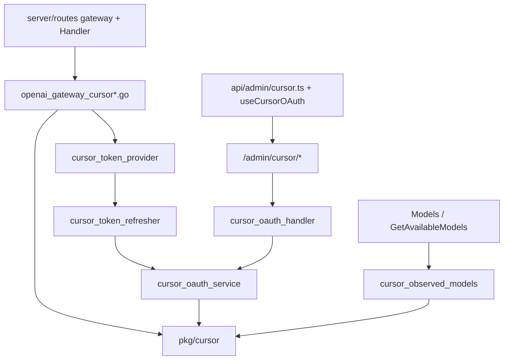

# 实施指导

## 1. 使用方式与不可变边界

本指南把 `proposal.md`、`design.md` 和 `specs/cursor-platform/spec.md` 转换为可按依赖顺序实施、可逐阶段评审的操作步骤。若本指南与 spec 冲突，以 spec 为准，并先更新 OpenSpec 再编码。

实施前必须满足：

- 上游协议细节（Connect 封帧、字段号、checksum 算法、深链 `/auth/poll`、错误分类、计费与调度取舍）已冻结并回填 `design.md`，`pkg/cursor` 按此实现；仅多模态图片字段号与 `ClientSideToolV2` 工具枚举对照为二期 TODO。
- 未配置 Cursor 账号时既有平台行为完全不变（新平台默认零影响）。
- Cursor 凭据（access token / refresh token / user API key / checksum 派生 token）只允许存在于加密 credentials、解密后的短生命周期内存和发往上游的请求头，不得进入日志、错误响应或前端持久化状态。

明确不做：改动既有 Cursor IDE 客户端兼容逻辑、实现 Cursor 图像 / 视频 / 音频、引入重型 protobuf/HTTP2 运行时、硬编码对外默认模型清单、重构调度 / 计费 / 分组架构；以及 **Cursor 有状态多 agent 能力（Cloud Agents / Agents Window / SDK runs / cloud subagents）——out-of-scope，不排期**（详见 `proposal.md` 的 Non-Goals 与方案 C）。

## 2. 目标依赖方向



依赖规则：

1. `pkg/cursor` 不 import `internal/service` / `internal/handler`；wire 细节单向下沉。
2. 网关翻译层只依赖 `pkg/cursor` 暴露的 Go 接口和结构，绝不直接拼 protobuf 字节或 checksum。
3. 平台枚举同步是硬前置；缺任何一个调度 / 计费 / 校验分支都算未完成。
4. observed 模型合并必须对外可见，且 `/v1/models` 与 Admin 可用模型接口结果一致。
5. 参照 Grok，不新增数据库业务表；只加平台 CHECK 约束迁移。

## 3. 分阶段实施顺序

阶段顺序对应 `tasks.md` 分组，每个 Phase 应可单独编译 / 评审。

### Phase B：平台枚举接线（最先，纯机械但必须完整）

1. `domain/constants.go` 加 `PlatformCursor`；`service/domain_constants.go` re-export + `AllowedQuotaPlatforms`。
2. 逐点同步 `design.md` 决策 1 触点表：`error_passthrough_rule.go`、`composite_platform.go`、`group.go`、`admin_group.go`、`channel_service.go`、`scheduler_snapshot_service.go`（注意 `[5]string` → `[6]string`）、`token_cache_invalidator.go`、`endpoint.go`、`ent/schema/user_platform_quota.go`。
3. `token_refresh_service.go`、`wire.go`、路由的注册留到 Phase D/F（依赖具体 service），此处只加枚举分支。
4. 结束标准：`go build ./...` 通过；平台相关单测通过；grep `PlatformGrok` 的每个非 Grok 专有触点都已评估是否需要对应 Cursor 分支。

### Phase C：`pkg/cursor` 上游协议包

1. `doc.go` 常量 → `envelope.go`（先做，纯字节，最易单测）→ `proto.go`（按已冻结字段号）→ `models.go` / `chat.go`。
2. `oauth.go`（`ParseWorkosSessionToken`、`ExchangeUserAPIKey`、`RefreshWithRefreshToken`、深链 + `/auth/poll`）。
3. `checksum.go` / `identity.go`（`BuildUpstreamHeaders`），按 design 决策 6 的已冻结算法实现（machineId/macMachineId、Jyh 异或、base64 URL-safe）。
4. 结束标准：`pkg/cursor` 单测通过（envelope round-trip / trailer / 截断、header 稳定性、oauth 解析）；不依赖任何上层包。

### Phase D：token provider / refresher / oauth service

1. `account.go` 访问器 → `cursor_oauth_service.go`（三来源导入）→ `cursor_token_provider.go` → `cursor_token_refresher.go` → `cursor_credential_failure.go`。
2. `repository/cursor_oauth_client.go` 封装认证端点 HTTP。
3. `token_refresh_service.go` 的 `registrations` 注册 Cursor。
4. 结束标准：可用 Cookie / API Key 导入账号并拿到 access token；过期后两条路径都能刷新；单测通过。

### Phase E：网关翻译层

1. `cursor_upstream_url.go` / `cursor_upstream_headers.go` / `cursor_upstream_errors.go`（错误按 design 决策 9 分类：resource_exhausted 不封号 / 401 先刷新 / 带模型名剔除模型 / 额度耗尽冷却）。
2. `openai_gateway_cursor.go`（请求翻译，含 `tools`/`tool_choice` 原样透传、system→Instruction.text，禁止 strip）→ `openai_gateway_cursor_stream.go`（响应帧流 → SSE / 聚合，text→content、thinking→reasoning_content、tool_call→并列 tool_calls）。
3. `handler/openai_gateway_handler.go` 为 `platform == cursor` 分派；`server/routes/gateway.go` 按需接线。
4. 接入位置不变量：鉴权、body limit、模型解析之后；账号选择 / 并发 slot / 计费预扣 / 上游拨号 / SSE 首字节之前。
5. 结束标准：`/v1/chat/completions` 非流式与流式 golden 单测通过；`tools` 透传与并行 tool_calls 通过；首字节时序断言通过；上游错误按分类正确映射为 OpenAI envelope。

### Phase F：Admin + Wire

1. `handler/admin/cursor_oauth_handler.go` → `Handlers.Admin.CursorOAuth`。
2. `server/routes/admin.go` 的 `registerCursorOAuthRoutes` 挂 `/admin/cursor/*`。
3. `wire.go` 增加 provider 与 Bind；`go generate`（wire）重生成 `wire_gen.go`。
4. 结束标准：`go build ./...` + wire 通过；Admin 端能走完导入 / 刷新 / 探测。

### 迁移（可与 Phase F 并行）

1. 取当前最大迁移号（现为 221）+1 起新文件。
2. 参照 157 号：`ALTER TABLE ... DROP CONSTRAINT ...; ADD CONSTRAINT ... CHECK (platform IN (..., 'cursor'))`。
3. 参照 172 号更新 `composite_model_routes.target_platform` CHECK；复核 176 号渠道监控 provider 约束是否需要 `cursor`。

### Phase H：前端

1. `types/index.ts` 联合类型 → `api/admin/settings.ts` `PLATFORMS`。
2. `api/admin/cursor.ts` + `composables/useCursorOAuth.ts`（参照 grok）。
3. 账号表单 / OAuth 流 / 图标 / 徽章 / 颜色 / 视图 / i18n。
4. `useModelWhitelist.ts` 接 observed 模型。
5. 结束标准：`lint:check` / `typecheck` / vitest / `build` 通过。

### 动态模型合并（贯穿 Phase C/E，验收在最后）

- `cursor_observed_models.go` 在 Phase D/E 完成鉴权后接入；`GetAvailableModels` / `compositeAvailableModels` 的合并在 Phase E 后打通并在端到端验证。

## 4. 关键类型建议（接口级，最终以实现为准）

### 4.1 凭据

```go
type Account /* 既有 */ struct{ /* Platform, Type, Credentials, Extra ... */ }

func (a *Account) IsCursor() bool
func (a *Account) GetCursorAccessToken() string
func (a *Account) GetCursorBaseURL() string
func (a *Account) GetCursorRefreshToken() string
func (a *Account) GetCursorUserAPIKey() string
```

### 4.2 上游协议（见 `design.md` 决策 2 的完整草案）

```go
cursor.WriteEnvelope(w, flag, payload)
cursor.NewEnvelopeReader(r).Next() (flag, payload, err)
cursor.MarshalChatRequest(*ChatRequest) ([]byte, error)
cursor.UnmarshalChatDelta([]byte) (*ChatDelta, error)
cursor.BuildUpstreamHeaders(token, now) http.Header
```

### 4.3 observed 模型快照（对齐 grok）

```go
type cursorObservedModelsSnapshot struct {
    Models    []string `json:"models"`
    FetchedAt string   `json:"fetched_at"`
    Source    string   `json:"source,omitempty"` // "upstream_available_models"
}
// 存 account.Extra["cursor_observed_models"]
```

## 5. 平台枚举触点矩阵

下表是提案编写时确认的 `PlatformGrok` 引用点，实施时逐条处理并用结构 / 编译测试锁定（以代码为准）：

| 文件 | 引用点 | Cursor 动作 |
| --- | --- | --- |
| `domain/constants.go` | const 19–27 | 加 `PlatformCursor` |
| `service/domain_constants.go` | 41–46 / 55–61 / 65–69 | re-export + quota 白名单；调度阈值按开放问题 |
| `model/error_passthrough_rule.go` | 37–39 / 44 | 常量 + `AllPlatforms()` |
| `service/composite_platform.go` | 107 / 134 / 182 | concrete 集合加 cursor |
| `service/group.go` | 449–454 | `profitControlPlatformSupported` |
| `service/scheduler_snapshot_service.go` | 612 / 827–829 | switch 分支 + 数组 `[6]` |
| `service/token_refresh_service.go` | 134–142 | registrations 注册 |
| `service/token_cache_invalidator.go` | 45–51 | case 删除 cache key |
| `service/wire.go` / `cmd/server/wire_gen.go` | Grok provider | provider + Bind |
| `server/routes/admin.go` | 58 / 466 | `registerCursorOAuthRoutes` |
| `server/routes/gateway.go` | 平台路由 | 按需 |
| `handler/openai_gateway_handler.go` | Grok 分派 | Cursor protobuf 分派 |
| `handler/gateway_handler.go` | 1150 / 1172 / 1341(GetAvailableModels) | 平台数组 + observed 合并 |
| `handler/endpoint.go` | 187 | endpoint 归一 |
| `ent/schema/user_platform_quota.go` | Validate | 允许 cursor |
| `migrations/*` | 142/157/172/176 | 新迁移加 cursor CHECK |

## 6. 常见错误

- 只在 `domain/constants.go` 加枚举，漏改调度 / 计费 / 校验分派，导致 Cursor 账号被静默跳过或校验失败。
- 把 protobuf / checksum 逻辑写进 `service`，而不是隔离在 `pkg/cursor`，导致无法单测、字段号变更牵动业务层。
- 偏离 design 已冻结的字段号 / 封帧 / checksum 算法自行改写；如需修正必须先回写 `design.md`。
- observed 模型只写进 `Extra` 却不合并进 `/v1/models`（重蹈 Grok 现状缺口）——用户核心诉求未满足。
- SSE 在收到上游首帧前写了 200 / 首字节，导致无法返回上游错误状态。
- Connect envelope 用小端或漏读 4 字节长度，或没处理 EndStream trailer 帧。
- `schedulerSnapshotPlatforms()` 忘记把数组长度从 `[5]` 改成 `[6]`（编译期会报，但要记得）。
- 修改已应用迁移而不是新增迁移。

## 7. Definition of Done

- 全部平台枚举触点已同步，`go build ./...` + wire 通过，`PlatformGrok` 对应触点都已评估 Cursor 分支。
- `pkg/cursor` envelope / proto / oauth / header 单测通过，且不依赖上层包。
- 三来源导入与两条刷新路径可用，接入既有令牌刷新 / 缓存失效框架。
- `/v1/chat/completions` 非流式与流式跑通，上游错误正确映射，首字节时序正确。
- `/v1/models` 返回 Cursor observed 动态模型，Admin 可用模型接口结果一致。
- 未配置 Cursor 时既有平台行为、调度、计费、`/admin/*` 完全不变。
- 前端 lint / typecheck / vitest / build 通过，Cursor 可在账号 / 分组界面创建与展示。
- `openspec validate add-cursor-platform --type change --strict --no-interactive` 通过。
- 首期只交付无状态 chat 网关（chat + 动态 models + `tools` 透传）；Cloud Agents 等有状态多 agent 能力不在交付范围（out-of-scope），仅多模态图片与内置工具枚举对照为二期 TODO。
